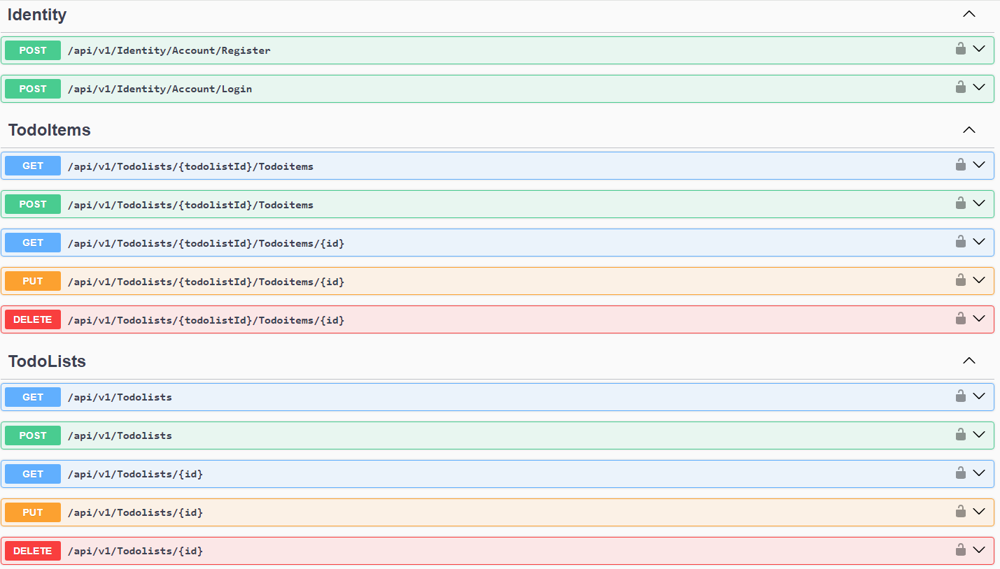
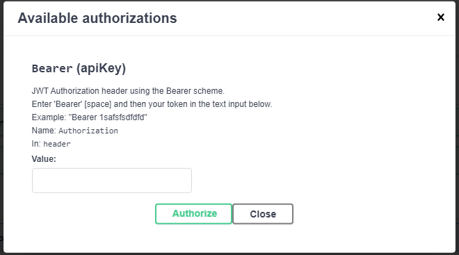

# ToDoApp

# Swagger UI

# Jwt Auth

## Link to proyect on Azure
    https://todoappabo.azurewebsites.net/swagger/index.html

## Overview
ToDoApp is a .NET web application designed to manage a list of tasks. This application uses modern development practices and technologies including Clean Code principles, Mediatr, Entity Framework Core 8 for data access, SQL Server for the database, and ASP.NET Core Identity for security. The app is published on Azure for hosting.

## Features
- Task management (CRUD operations)
- User authentication and authorization
- Modern architecture using Clean Code principles
- CQRS pattern implemented using Mediatr
- Code-first approach with EF Core 8
- SQL Server database
- Hosted on Azure

## Technologies Used
- .NET 8
- ASP.NET Core
- Entity Framework Core 8
- SQL Server
- Mediatr
- ASP.NET Core Identity
- Azure App Services
- FluentValidation
- Serilog and AzureAppServices for logging

## Unit Testing
Both the application and infrastructure projects are thoroughly unit tested using the following tools and libraries:

- Xunit
- Fluent Assertions
- NSubstitute
- NSubstitute
- AutoFixture

## Getting Started

### Prerequisites
- .NET 8 SDK
- SQL Server
- Azure account (for deployment)

### Installation

1. Clone the repository
    git clone https://github.com/abeltran12/ABO.ToDoApp

2. Set up the database
    - Ensure SQL Server is running and accessible.
    - Update the connection string in `appsettings.json`:
      "ConnectionStrings": {
        "DefaultConnection": "yourconfig"
      }
3. Set up the Jwt config section for security
     - On `appsettings.json`:
      "JwtSettings": {
        "Key": "yourconfig",
        "Issuer": "yourconfig",
        "Audience": "yourconfig",
        "Expires": "yourconfig",
       }

3. Apply the migrations and seed the database
    - dotnet ef migrations add Initial
    - dotnet ef database update

4. Build and run the application
    - dotnet build
    - dotnet run
